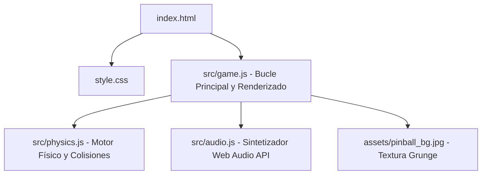

# 90s Rock Pinball 🎸⚡
### *Grunge, Metal & Neon Nostalgia — Retro Arcade Experience*

¡Bienvenido a **90s Rock Pinball**, una máquina de pinball virtual en 2D interactiva, inspirada en la música y la estética del rock alternativo, grunge y metal de la década de 1990! 

Este proyecto ha sido desarrollado siguiendo un enfoque incremental **por capas**. La versión actual (**Capa 1**) implementa el motor de física vectorizado, síntesis de sonido procedural mediante Web Audio API, animaciones de luces de neón y un tablero de juego totalmente jugable.

---

## 📖 Tabla de Contenidos
1. [Descripción del Proyecto](#-descripción-del-proyecto)
2. [Arquitectura del Sistema](#📐-arquitectura-del-sistema)
   - [Motor de Física 2D Vectorial](#1-motor-de-física-2d-vectorial)
   - [Dinámica de Flippers (Cápsulas Giratorias)](#2-dinámica-de-flippers-cápsulas-giratorias)
   - [Evitación de Efecto Túnel (Sub-stepping)](#3-evitación-de-efecto-túnel-sub-stepping)
   - [Síntesis de Audio Procedural (Web Audio API)](#4-síntesis-de-audio-procedural-web-audio-api)
   - [Diseño Estético y Gráficos](#5-diseño-estético-y-gráficos)
3. [Estructura del Código](#📂-estructura-del-código)
4. [Componentes del Tablero](#🕹️-componentes-del-tablero)
5. [Controles y Teclas](#⌨️-controles-y-teclas)
6. [Instalación y Ejecución](#🛠️-instalación-y-ejecución)
7. [Historial de Depuración Clave](#bug-historial-de-depuración-clave)
8. [Próximas Capas de Desarrollo](#-próximas-capas-de-desarrollo)

---

## 📝 Descripción del Proyecto
El juego pone al usuario al mando de un tablero clásico de arcade con un diseño visual espectacular de estilo *grunge-neon* oscuro. El objetivo es lanzar la bola con un resorte mecánico y mantenerla en juego usando dos flippers para golpear parachoques de bandas emblemáticas como **Nirvana**, **Guns N' Roses** y **Rage Against the Machine**, así como derribar dianas de **Stone Temple Pilots** y pasar por carriles para acumular puntaje e incrementar el multiplicador.

El juego cuenta con un panel lateral con estética de cristal esmerilado (*glassmorphic*), marcadores digitales retro con sombras de neón, un sistema de vidas (3 bolas representadas por iconos de guitarra), un sistema de empuje de la mesa (nudge/TILT) y una pista de música integrada generada procedimentalmente en tiempo real.

---

## 📐 Arquitectura del Sistema

El proyecto está diseñado bajo un enfoque de **código modular limpio (Vanilla JS / ES Modules)** sin dependencias externas pesadas, asegurando un rendimiento fluido a 60 FPS estables.



### 1. Motor de Física 2D Vectorial
En lugar de depender de librerías de física genéricas (como Matter.js), que a menudo sufren de imprecisiones en los rebotes rápidos o permiten que la bola atraviese los flippers, implementamos un motor físico vectorial especializado en `src/physics.js`.

*   **Vectores de Estado**: La bola se define con una posición $\mathbf{pos} = (x, y)$, velocidad $\mathbf{vel} = (vx, vy)$, radio $R$, masa $m$ y gravedad constante ($g = 900\text{ px/s}^2$).
*   **Colisión con Líneas (Segmentos)**:
    1. Se calcula el vector del segmento $AB = B - A$ y el vector de la bola al inicio $AC = C - A$.
    2. Se proyecta $AC$ sobre $AB$ y se limita el factor de proyección $t$ entre $0$ y $1$ para obtener el punto más cercano $P$ sobre el segmento.
    3. Si la distancia $d = \|\mathbf{pos} - P\| < R + R_{adicional}$ (donde $R_{adicional}$ es el grosor del segmento o flipper), hay colisión.
    4. El vector normal de contacto $\mathbf{n}$ apunta desde el segmento hacia el centro de la bola.
*   **Resolución de Impulso**:
    La velocidad de la bola se actualiza basándose en la conservación del momento con restitución (rebote $e$) y fricción ($f$):
    $$\mathbf{v}' = \mathbf{v}_{rel} - (1 + e)(\mathbf{v}_{rel} \cdot \mathbf{n})\mathbf{n} + \mathbf{v}_{superficie}$$
    *   Para parachoques (**Bumpers**), se inyecta un impulso activo adicional de velocidad constante en la dirección de la normal ($+220\text{ px/s}$).
    *   Para **Slingshots** (lanzadores triangulares), se inyecta un impulso de $+280\text{ px/s}$.

### 2. Dinámica de Flippers (Cápsulas Giratorias)
Los flippers se modelan físicamente como cápsulas redondeadas de radio $R_f$ en movimiento circular sobre un pivote $A$.
*   Al presionar el botón, el flipper barre hacia arriba con una velocidad angular constante $\omega_{up} \approx 26\text{ rad/s}$.
*   Al soltar el botón, retorna mediante un muelle a una velocidad $\omega_{down} \approx -13\text{ rad/s}$.
*   Al colisionar, el punto de impacto $P$ del flipper tiene una velocidad lineal instantánea proporcional a su distancia al pivote $\mathbf{r} = P - A$:
    $$\mathbf{v}_{flipper} = (-\omega \cdot r_y, \omega \cdot r_x)$$
*   La colisión se resuelve usando la velocidad relativa de la bola respecto al flipper: $\mathbf{v}_{rel} = \mathbf{v}_{bola} - \mathbf{v}_{flipper}$. Esto permite que golpear la bola en pleno swing la lance a gran velocidad (tiro potente), mientras que dejar el flipper inmóvil solo produce un rebote amortiguado pasivo.

### 3. Evitación de Efecto Túnel (Sub-stepping)
Debido a las velocidades extremas que puede adquirir la bola (hasta $2800\text{ px/s}$), una sola actualización por frame ($16.7\text{ms}$ a 60Hz) causaría "efecto túnel" (la bola se salta la colisión y atraviesa la pared). 
Para solucionar esto, el bucle principal en `src/game.js` subdivide cada frame en **8 sub-pasos físicos (sub-stepping)** independientes:
$$\delta t = \frac{\Delta t}{8}$$
En cada sub-paso se actualiza la posición, se calculan las fuerzas y se resuelven las colisiones de forma secuencial. Esto reduce el desplazamiento máximo de la bola a menos de $3\text{px}$ por paso, garantizando que el motor de detección sea increíblemente preciso y estable.

### 4. Síntesis de Audio Procedural (Web Audio API)
En lugar de cargar archivos `.mp3` o `.wav` pesados que ralentizan la carga inicial, `src/audio.js` utiliza el chip de audio nativo del navegador para sintetizar sonido analógico retro:
*   **Bajos Grunge**: Bucle procedural de 8 compases en escala menor de Re que reproduce una línea de bajo sintetizada de onda de diente de sierra filtrada con barrido envolvente (similar a un sintetizador Moog/Novation).
*   **Bombo y Platillo**: Bucle rítmico integrado en el secuenciador para acompañar el bajo.
*   **Bumpers (Heavy Drums)**: Combinación de un oscilador de onda triangular con caída rápida de frecuencia ($100\text{Hz} \to 30\text{Hz}$) acoplado a un generador de ruido blanco de paso bajo para simular un redoblante/caja grunge pesado.
*   **Guitarras / Dianas (Power Chords)**: Dos osciladores en intervalo de quinta justa (Re3 + La3) con ligera desafinación (*detuning*) y filtro de paso bajo dinámico que emula el ataque distorsionado de una guitarra eléctrica.
*   **Émbolo (Launcher)**: Zumbido de frecuencia ascendente a medida que el jugador tensa el resorte del lanzador.

### 5. Diseño Estético y Gráficos
*   **Textura de Fondo (`assets/pinball_bg.jpg`)**: Gráfico vertical personalizado que contiene sutiles grafitis urbanos, guitarras eléctricas, calaveras aladas y vinilos retro, fundiéndose con los carriles metálicos en 3D.
*   **Filtro CRT Scanlines**: Un gradiente lineal repetitivo superpuesto por CSS sobre el canvas para simular las líneas físicas de escaneo de los monitores de tubo catódico de los arcades noventeros.
*   **Efecto de Cristal (Glassmorphic)**: El menú de puntajes utiliza `backdrop-filter: blur(12px)` con bordes semitransparentes delgados para dar una sensación premium y tridimensional.

---

## 📂 Estructura del Código

```bash
├── assets/
│   └── pinball_bg.jpg     # Imagen de fondo del tablero de juego
├── src/
│   ├── audio.js           # Sintetizador Web Audio API e hilo musical
│   ├── physics.js         # Motor físico 2D (Vectores, rebotes e impulsos)
│   └── game.js            # Inicialización de walls, bucle de render y lógica de juego
├── index.html             # Estructura semántica, fuentes de Google y HUD
├── style.css              # Estilos, efectos de brillo de neón y filtro CRT
├── package.json           # Scripts de Vite para el entorno de desarrollo
└── README.md              # Este archivo descriptivo
```

---

## 🕹️ Componentes del Tablero

*   **Carriles R-O-C-K (Rollovers)**: Cuatro carriles en la parte superior. Al pasar la bola por ellos se ilumina la letra respectiva. Si iluminas las cuatro letras, el multiplicador sube y se resetean después de 1 segundo.
*   **Bumpers de Bandas**:
    *   *Nirvana Bumper* (Amarillo): Parachoques superior central.
    *   *Guns N' Roses Bumper* (Rojo): Parachoques intermedio izquierdo.
    *   *Rage Against the Machine Bumper* (Celeste): Parachoques intermedio derecho.
    *(Al golpear cualquiera 5 veces se activa su modo de música, se duplican sus puntos e incrementa el multiplicador).*
*   **Dianas de Caída (Drop Targets)**: Tres objetivos de **Stone Temple Pilots** (`STP`) a la izquierda. Al derribar los tres se obtiene un gran bonus de 20.000 puntos y vuelven a levantarse.
*   **Rampa Metálica**: Ubicada a la izquierda. Si la bola entra con velocidad suficiente ($vy < -150\text{ px/s}$), se acopla a una trayectoria curva de carriles flotantes iluminados que la lleva hasta la parte superior de los rollover lanes.
*   **Slingshots**: Dos rebotadores triangulares activos justo arriba de los flippers que disparan la bola lateralmente a alta velocidad.

---

## ⌨️ Controles y Teclas

| Tecla | Acción |
| :--- | :--- |
| **`A`** o **`←`** | Activar Flipper Izquierdo |
| **`L`** o **`→`** | Activar Flipper Derecho |
| **Mantener `Espacio`** | Comprimir el resorte del lanzador (Plunger) |
| **Soltar `Espacio`** | Lanzar la bola al tablero |
| **`T`** | Sacudir la mesa (¡Ojo con el TILT! 3 sacudidas y pierdes la bola) |
| **`M`** | Activar / Apagar el bajo musical procedural |
| **`R`** | Reiniciar partida / Cargar sistemas de audio |

---

## 🛠️ Instalación y Ejecución

Para ejecutar este juego en tu entorno de desarrollo local, sigue estos pasos:

1.  **Clonar o descargar** el repositorio en tu máquina.
2.  **Instalar dependencias** (necesario para Vite):
    ```bash
    npm install
    ```
3.  **Iniciar el servidor de desarrollo**:
    ```bash
    npm run dev
    ```
4.  **Jugar**: Abre el navegador en [http://localhost:5173](http://localhost:5173) (o el puerto indicado por tu terminal).

---

## 🐛 Historial de Depuración Clave

Durante el desarrollo de la Capa 1, se corrigieron dos bugs geométricos fundamentales mediante cálculos de vectores:

1.  **Colisión en el Carril de Lanzamiento (Plunger)**:
    *   *Bug*: La bola rebotaba dentro del canal de lanzamiento sin poder salir al juego.
    *   *Causa*: La pared exterior derecha del outlane estaba definida de `(480, 640)` a `(420, 710)`. Como el carril del lanzador reside entre $X = 440$ y $X = 480$, esta pared diagonal cruzaba el carril por la mitad en $Y \approx 675$, bloqueando la bola.
    *   *Solución*: Se movió la coordenada de inicio del segmento a `(440, 640)`, limpiando el canal y logrando una estructura simétrica.
2.  **Atascamiento en los Pasillos Laterales (Outlanes)**:
    *   *Bug*: La bola se encajaba y quedaba quieta eternamente en el canal izquierdo de salida (outlane).
    *   *Causa*: El punto inferior de la cuña divisoria interna estaba configurado en `X = 80`. Como la guía exterior terminaba en `X = 80, Y = 710`, la salida hacia el drenaje medía solo 10 píxeles, atrapando la bola de 22 píxeles de diámetro.
    *   *Solución*: Se ajustaron los límites de las cuñas a `X = 100` (izquierda) y `X = 360` (derecha), abriendo las salidas a **28.6 píxeles**, suficiente para que la bola fluya al vacío de forma natural.

---

## 🎸 Próximas Capas de Desarrollo
*   **Capa 2 (Gráficas de Bandas)**: Añadir calcomanías estáticas e ilustraciones vectoriales detalladas de bandas en el playfield (Guns N' Roses, Nirvana, Korn, System of a Down, Pearl Jam, Faith No More).
*   **Capa 3 (Audio Temático)**: Integrar covers sintetizados o fragmentos de loops de audio reales de riffs noventeros clásicos activables según el modo de banda encendido.
*   **Capa 4 (Lógica Multibola)**: Añadir modo de multibola ("Riot Multiball") al encender los tres bumpers de bandas principales de manera simultánea.
